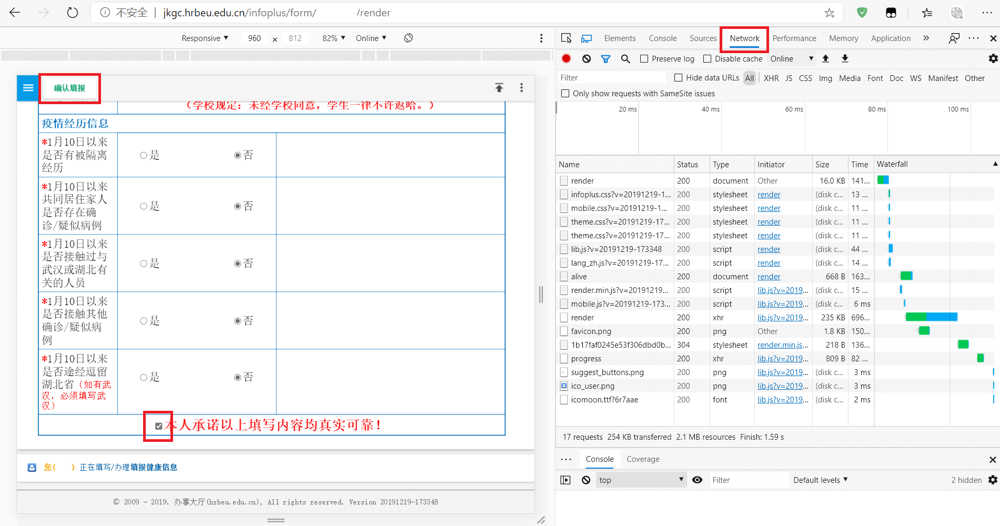
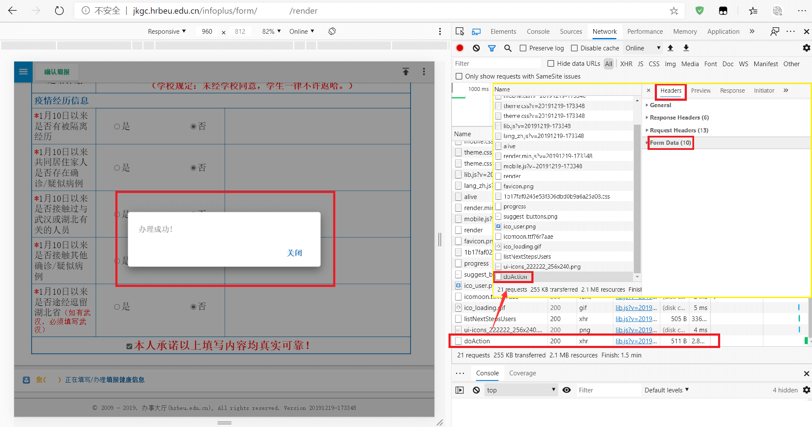
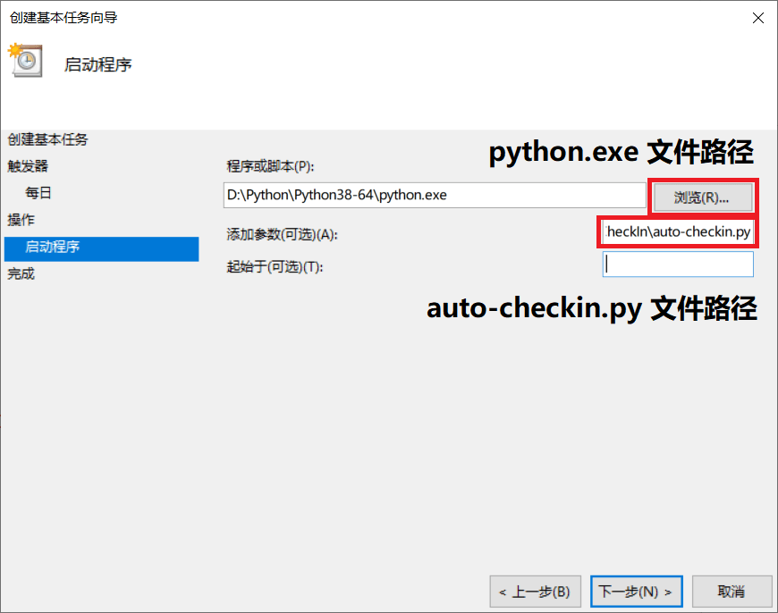

最近这几天又不知道干点啥，天天上课累死了，前面的还没掌握就又要接新的知识，真是太难了。心血来潮想好好学一下 JavaScript 什么的前端基础，找资料逛博客的时候碰巧发现了一个学长的博客，看到《[疫情期间自动健康打卡暨 CAS 单点登录认证实践 - SiteForZJW](https://zjw1.top/2020/03/10/auto_checkin_during_covid19_and_cas_sso_learning/)》这篇文章，常年起不来床的我赶紧点开了，啊啊啊我为什么没有早点发现这种好东西啊，生气。

第一次看的时候了解到这个 Python 代码要自己先手动执行一边获取表单数据。Emmm，那是啥，好像不太了解呢，先 Mark 了！

## Python 和依赖

什么？你说这个年头还有人电脑上没装 Python？なんと！

Windows 系统直接上 Python 官网下载安装包，注意将 Python 安装目录添加到 PATH 环境变量，一并安装 pip。如果运行时显示缺少模块就 pip 安装一下。

```bash
python -m pip install --upgrade pip
pip install requests lxml
```

## 获取 form Data

今天早上起来的出奇的早（7 点半我就醒了），一想到学校的打卡十点前就要完成，我突然想到了那个自动打卡、表单数据的事情。于是我点开了浏览器开始尝试。

打开 [网上办事中心 - 平安行动](http://one.hrbeu.edu.cn/infoplus/form/JKXXSB/start) ，虽然不知道是啥，但 F12 肯定会告诉我的。选择 Network 栏，网页从打开这个菜单后加载的所有请求都会在这里显示，先刷新一遍网页，找了一遍好像什么也没有（一开始我以为表单数据是缓存下来的什么东西），Emmm，提交一遍试试，点完确认提交之后 Network 最下面显示了一个新的名叫 `doAction` 资源，那一定就是你了！

好的，`Form Data` Get√ 。选择 `view parsed` `view decoded` 就能看到这个表单的所有数据，也就是之前 Python 自动打卡需要自定义的。完整存好 `formData` `boundFields` 的内容。



## 调试

表单数据有了，开始调试 Python 。

### 邮件提醒

源代码最后的发送邮件部分需要自行引用发送邮件的 `.py` 文件，但是谷歌找到的好几个 `sendmail.py` 补上去之后都有奇怪的报错，比如 `if` 条件右括号报语法错误，我明明是直接复制的啊 QaQ ，看了好几遍也不应该有错啊（后来发觉可能是 Python 版本问题）。最终我索性直接搜 Python SMTP 的用法，找了一段代码补上去。

在 Linux 下试运行的时候发现打卡段没问题，但是后面邮件发送这段报错：

```powershell
Traceback (most recent call last):
  File "checkin.py", line 151, in <module>
    smtpObj.connect(mail_host, 25)    # 25 为 SMTP 端口号
  File "/usr/lib64/python3.6/smtplib.py", line 336, in connect
    self.sock = self._get_socket(host, port, self.timeout)
  File "/usr/lib64/python3.6/smtplib.py", line 307, in _get_socket
    self.source_address)
  File "/usr/lib64/python3.6/socket.py", line 724, in create_connection
    raise err
  File "/usr/lib64/python3.6/socket.py", line 713, in create_connection
    sock.connect(sa)
TimeoutError: [Errno 110] Connection timed out
```

搜索了一圈发现 Linux 下 SMTP 发信加密程度要求更高，所以得加密发信，将原来的发信替换为 SSL 加密发信：

```python
smtpObj = smtplib.SMTP_SSL() 
smtpObj.connect(mail_host, 465)      # 一般加密发信 smtp 端口号为 465
```

在 3.7 版本以上的 Python 中需要此脚本时必须使用 `smtpObj = smtplib.SMTP_SSL(mail_host)` ，否则邮件发信会报错 ValueError 如下：

```powershell
Traceback (most recent call last):
  File "/home/Project/Python/HEUCheckin-2018041015.py", line 170, in <module>
    smtpObj.connect(mail_host, 465)       # 加密时 SMTP 端口号为 465
  File "/usr/local/Python3.8.2/lib/python3.8/smtplib.py", line 339, in connect
    self.sock = self._get_socket(host, port, self.timeout)
  File "/usr/local/Python3.8.2/lib/python3.8/smtplib.py", line 1042, in _get_socket
    new_socket = self.context.wrap_socket(new_socket,
  File "/usr/local/Python3.8.2/lib/python3.8/ssl.py", line 500, in wrap_socket
    return self.sslsocket_class._create(
  File "/usr/local/Python3.8.2/lib/python3.8/ssl.py", line 1031, in _create
    self._sslobj = self._context._wrap_socket(
ValueError: server_hostname cannot be an empty string or start with a leading dot.
```

### 关闭代理

本地调试的时候，由于我平时习惯开 Clash 代理挂着，没注意这个，结果就报错了，信息如下：


<details><summary><strong>Python Traceback</strong></summary><br />


```powershell
Traceback (most recent call last):
  File "D:\Python\Python38-64\lib\site-packages\urllib3\connectionpool.py", line 665, in urlopen
    httplib_response = self._make_request(
  File "D:\Python\Python38-64\lib\site-packages\urllib3\connectionpool.py", line 421, in _make_request
    six.raise_from(e, None)
  File "<string>", line 3, in raise_from
  File "D:\Python\Python38-64\lib\site-packages\urllib3\connectionpool.py", line 416, in _make_request
    httplib_response = conn.getresponse()
  File "D:\Python\Python38-64\lib\http\client.py", line 1322, in getresponse
    response.begin()
  File "D:\Python\Python38-64\lib\http\client.py", line 303, in begin
    version, status, reason = self._read_status()
  File "D:\Python\Python38-64\lib\http\client.py", line 272, in _read_status
    raise RemoteDisconnected("Remote end closed connection without"
http.client.RemoteDisconnected: Remote end closed connection without response

During handling of the above exception, another exception occurred:

Traceback (most recent call last):
  File "D:\Python\Python38-64\lib\site-packages\requests\adapters.py", line 439, in send
    resp = conn.urlopen(
  File "D:\Python\Python38-64\lib\site-packages\urllib3\connectionpool.py", line 719, in urlopen
    retries = retries.increment(
  File "D:\Python\Python38-64\lib\site-packages\urllib3\util\retry.py", line 436, in increment
    raise MaxRetryError(_pool, url, error or ResponseError(cause))
urllib3.exceptions.MaxRetryError: HTTPConnectionPool(host='127.0.0.1', port=7890): Max retries exceeded with url: http://cas.hrbeu.edu.cn/cas/login?service=http%3A%2F%2Fjkgc.hrbeu.edu.cn%2Finfoplus%2Flogin%3FretUrl%3Dhttp%253A%252F%252Fjkgc.hrbeu.edu.cn%252Finfoplus%252Fform%252FJSXNYQSBtest%252Fstart%253Fticket%253DST-3779417-6SDr7iRPSkJxSd3MFyNd-cas01.example.org (Caused by ProxyError('Cannot connect to proxy.', RemoteDisconnected('Remote end closed connection without response')))

During handling of the above exception, another exception occurred:

Traceback (most recent call last):
  File "d:/workshop/PythonProject/CheckIn/checkin.py", line 61, in <module>
    response302 = sesh.post(req.url, data=user_form, headers=headers)
  File "D:\Python\Python38-64\lib\site-packages\requests\sessions.py", line 578, in post
    return self.request('POST', url, data=data, json=json, **kwargs)
  File "D:\Python\Python38-64\lib\site-packages\requests\sessions.py", line 530, in request
    resp = self.send(prep, **send_kwargs)
  File "D:\Python\Python38-64\lib\site-packages\requests\sessions.py", line 665, in send
    history = [resp for resp in gen] if allow_redirects else []
  File "D:\Python\Python38-64\lib\site-packages\requests\sessions.py", line 665, in <listcomp>
    history = [resp for resp in gen] if allow_redirects else []
  File "D:\Python\Python38-64\lib\site-packages\requests\sessions.py", line 237, in resolve_redirects
    resp = self.send(
  File "D:\Python\Python38-64\lib\site-packages\requests\sessions.py", line 643, in send
    r = adapter.send(request, **kwargs)
  File "D:\Python\Python38-64\lib\site-packages\requests\adapters.py", line 510, in send
    raise ProxyError(e, request=request)
requests.exceptions.ProxyError: HTTPConnectionPool(host='127.0.0.1', port=7890): Max retries exceeded with url: http://cas.hrbeu.edu.cn/cas/login?service=http%3A%2F%2Fjkgc.hrbeu.edu.cn%2Finfoplus%2Flogin%3FretUrl%3Dhttp%253A%252F%252Fjkgc.hrbeu.edu.cn%252Finfoplus%252Fform%252FJSXNYQSBtest%252Fstart%253Fticket%253DST-3779417-6SDr7iRPSkJxSd3MFyNd-cas01.example.org (Caused by ProxyError('Cannot connect to proxy.', RemoteDisconnected('Remote end closed connection without response')))
```


</details><br />


报错一大堆没怎么看懂，`ProxyError` 看来应该是代理问题，可能和主机的网络设置有关系，没有深究原因，所以解决方案就是 **关掉代理** ！

> 尝试了在运行前用 `export` 或者 `set` 命令设置 `http_proxy` `https_proxy` 代理，也一样无法使用。

### 结果判定

调试时还发现个问题，原代码打卡出错的判定有缺陷，只报 Python 脚本出 Exception 时的错，而提交表单时可能成功提交，但是返回的不是打卡成功，而是打卡失败。那么如何判断打卡提交正常但是打卡失败呢，这里关注返回的数据 `response_end` ，用 requests 库转换成 text 后的 `response_end.text` 缩进一下长这个样子：

```json
# 成功时
{
  "errno":0,
  "ecode":"SUCCEED",
  "entities":[{
    "stepId":2,
    "name":"办结",
    "code":"autoStep1","status":0,"type":"Auto","flowStepId":0,"executorSelection":0,"timestamp":0,"posts":[],"users":[],"parallel":false,"hasInstantNotification":false,"hasCarbonCopy":false,"entryId":2797847,"entryStatus":0,"entryRelease":false
  }]
}

# 失败时
{
  "errno":22001,
  "ecode":"EVENT_CANCELLED",
  "error":"发生异常\n\njava.lang.reflect.InvocationTargetException\n\tat sun.reflect.GeneratedMethodAccessor457.invoke(Unknown Source)\n\t...\n",
  "entities":[]
}
```

可以看到返回的字段中 `errno` 为 `0` 代表成功提交，剩下的 `ecode` 显示 `str` 型的状态，`error` 只有出现错误时才有，包含了所有的错误信息，这个错误是在学校服务器上报的，不是本地脚本的问题。`entities` 包含成功提交后的一些数据。那么这就用 `errno` 来判定远程提交后返回是否成功。先使用 `json.loads()` 将其转换为 JSON 格式，注意在返回的数据中 `errno` 字段为 `int` 类型，`entities` 字段为 `list` 类型，发信的 `msg` 要用 `str()` 转换这两个数据。

实现代码如下：

```python
try:
    # ......

    response_end = sesh.post(submit_url, data=submit_form, headers=headers)
    resJson = json.loads(response_end.text)

    print('Form url: ', form_response.url)
    # print('Form status: ', response_end.text)
    print('Form Status: ', resJson['ecode'])
    print('Form stJson: ', resJson)
    # 获取表单返回 Json 数据所有 key 用这个
    # print('Form stJsonkey: ', resJson.keys())

    # 加入远程提交返回结果判断
    if (resJson['errno'] == 0):
        print('Form Succeed: ', resJson['ecode'])
        title = f'打卡成功 <{submit_form["stepId"]}>'
        msg = '\t表单地址: ' + form_response.url + '\n\n\t表单状态: \n\t\terrno：' + str(resJson['errno']) + '\n\t\tecode：' + str(resJson['ecode']) + '\n\t\tentities：' + str(resJson['entities']) + '\n\n\n\t完整返回：' + response_end.text
    else:
        print('Form Error: ', resJson['ecode'])
        title = f'打卡失败！校网出错'
        msg = '\t表单地址: ' + form_response.url + '\n\n\t错误信息: \n\t\terrno：' + str(resJson['errno']) + '\n\t\tecode：' + str(resJson['ecode']) + '\n\t\tentities：' + str(resJson['entities']) + '\n\n\n\t完整返回：' + response_end.text
except:
    print('\n:.:.:.:.: Except return :.:.:.:.:')
    err = traceback.format_exc()
    print('Python Error: \n', err)
    title = '打卡失败！脚本出错'
    msg = '\t脚本报错: \n\n\t' + err
```

好啦，现在就差不多完美了，唯一美中不足的就是没有加入 `retry` 的功能，还不了解这个怎么实现，有空可以试试。

## 完工


<details><summary><strong>修补完整的 auto-checkin.py</strong></summary><br />


```python
#!/usr/bin/env python3
# -*- coding: UTF-8 -*-

"""
平安行动自动打卡

Created on 2020-04-13 20:20
@author: ZhangJiawei & Monst.x
"""

import requests
import lxml.html
import re
import json
import random
import time
import smtplib
import traceback

headers = {
    "Accept": "text/html,application/xhtml+xml,application/xml;q=0.9,image/webp,image/apng,*/*;q=0.8,application/signed-exchange;v=b3;q=0.9",
    "Accept-Encoding": "gzip, deflate, br",
    "Accept-Language": "zh-CN",
    "Cache-Control": "max-age=0",
    "Connection": "keep-alive",
    "Content-Type": "application/x-www-form-urlencoded",
    "Cookie": "MESSAGE_TICKET=%7B%22times%22%3A0%7D; ",
    "Host": "cas.hrbeu.edu.cn",
    "Referer": "https://cas.hrbeu.edu.cn/cas/login?service=http%3A%2F%2Fjkgc.hrbeu.edu.cn%2Finfoplus%2Flogin%3FretUrl%3Dhttp%253A%252F%252Fjkgc.hrbeu.edu.cn%252Finfoplus%252Fform%252FJSXNYQSBtest%252Fstart",
    "Upgrade-Insecure-Requests": "1",
    "User-Agent": "Mozilla/5.0 (Windows NT 10.0; Win64; x64) AppleWebKit/537.36 (KHTML, like Gecko) Chrome/70.0.3538.102 Safari/537.36 Edge/18.18362"
}

data = {
    "username":"studentNumber",                # 学号
    "password":"password"                      # 教务处密码
}
def findStr(source, target):
    return source.find(target) != -1
title = ""
msg = ""

try:
    #get
    url_login = 'https://cas.hrbeu.edu.cn/cas/login?service=http%3A%2F%2Fjkgc.hrbeu.edu.cn%2Finfoplus%2Fform%2FJSXNYQSBtest%2Fstart'
    print("Begin to login ...")
    sesh = requests.session()
    req = sesh.get(url_login)
    html_content = req.text

    #post
    login_html = lxml.html.fromstring(html_content)
    hidden_inputs=login_html.xpath(r'//div[@id="main"]//input[@type="hidden"]')
    user_form = {x.attrib["name"] : x.attrib["value"] for x in hidden_inputs}

    user_form["username"]=data['username']
    user_form["password"]=data['password']
    user_form["captcha"]=''
    user_form["submit"]='登 录'
    headers['Cookie'] = headers['Cookie'] + req.headers['Set-cookie']

    req.url = f'https://cas.hrbeu.edu.cn/cas/login;jsessionid={req.cookies.get("JSESSIONID")}?service=http%3A%2F%2Fjkgc.hrbeu.edu.cn%2Finfoplus%2Fform%2FJSXNYQSBtest%2Fstart'
    response302 = sesh.post(req.url, data=user_form, headers=headers)
    casRes = response302.history[0]
    print("CAS response header", findStr(casRes.headers['Set-Cookie'],'CASTGC'))

    #get
    jkgc_response = sesh.get(response302.url)

    #post
    headers['Accept'] = '*/*'
    headers['Cookie'] = jkgc_response.request.headers['Cookie']
    headers['Host'] = 'jkgc.hrbeu.edu.cn'
    headers['Referer'] = jkgc_response.url
    jkgc_html = lxml.html.fromstring(jkgc_response.text)
    csrfToken = jkgc_html.xpath(r'//meta[@itemscope="csrfToken"]')
    csrfToken = csrfToken.pop().attrib["content"]
    jkgc_form = {
        'idc': 'JSXNYQSBtest',
        'release': '',
        'csrfToken': csrfToken,
        'formData': {
            '_VAR_URL': jkgc_response.url,
            '_VAR_URL_Attr': {
                'ticket': re.match(r'.*ticket=(.*)', jkgc_response.url).group(1)
            }
        }
    }
    jkgc_form['formData'] = json.dumps(jkgc_form['formData'])
    jkgc_url = 'http://jkgc.hrbeu.edu.cn/infoplus/interface/start'
    response3 = sesh.post(jkgc_url, data=jkgc_form, headers=headers)

    #get
    form_url = json.loads(response3.text)['entities'][0]
    form_response = sesh.get(form_url)

    #post
    headers['Accept'] = 'application/json, text/javascript, */*; q=0.01'
    headers['Referer'] = form_url
    headers['X-Requested-With'] = 'XMLHttpRequest'
    submit_url = 'http://jkgc.hrbeu.edu.cn/infoplus/interface/doAction'

    submit_html = lxml.html.fromstring(form_response.text)
    csrfToken2 = submit_html.xpath(r'//meta[@itemscope="csrfToken"]')
    csrfToken2 = csrfToken2.pop().attrib["content"]

    submit_form = {
        'actionId': '1',
        # boundFields 修改位置
        'boundFields': 'fieldCXXXdqszdjtx,fieldCXXXjtgjbc,...',
        'csrfToken': csrfToken2,
        # formData 修改位置
        'formData': r'{"_VAR_EXECUTE_INDEP_ORGANIZE_Name":"学院","_VAR_ACTION_INDEP_ORGANIZES_Codes":"xxxxx",...}',
        'lang': 'zh',
        'nextUsers': '{}',
        'rand': str(random.random() * 999),
        'remark': '',
        'stepId': re.match(r'.*form/(\d*?)/',form_response.url).group(1),
        'timestamp': str(int(time.time()+0.5))
    }
    response_end = sesh.post(submit_url, data=submit_form, headers=headers)
    resJson = json.loads(response_end.text)

    ## 表单填写完成，返回结果
    print('Form url: ', form_response.url)
    # print('Form status: ', response_end.text)
    print('Form Status: ', resJson['ecode'])
    print('Form stJson: ', resJson)
    # 获取表单返回 Json 数据所有 key 用这个
    # print('Form stJsonkey: ', resJson.keys())

    if (resJson['errno'] == 0):
        print('Form Succeed: ', resJson['ecode'])
        title = f'打卡成功 <{submit_form["stepId"]}>'
        msg = '\t表单地址: ' + form_response.url + '\n\n\t表单状态: \n\t\terrno：' + str(resJson['errno']) + '\n\t\tecode：' + str(resJson['ecode']) + '\n\t\tentities：' + str(resJson['entities']) + '\n\n\n\t完整返回：' + response_end.text
    else:
        print('Form Error: ', resJson['ecode'])
        title = f'打卡失败！校网出错'
        msg = '\t表单地址: ' + form_response.url + '\n\n\t错误信息: \n\t\terrno：' + str(resJson['errno']) + '\n\t\tecode：' + str(resJson['ecode']) + '\n\t\tentities：' + str(resJson['entities']) + '\n\n\n\t完整返回：' + response_end.text
except:
    print('\n:.:.:.:.: Except return :.:.:.:.:')
    err = traceback.format_exc()
    print('Python Error: \n', err)
    title = '打卡失败！脚本出错'
    msg = '\t脚本报错: \n\n\t' + err
finally:
    print('\n:.:.:.:.: Finally :.:.:.:.:')
    ## 发送邮件
    # import sendmail     ## 这个是普通.py文件，不是Python库
    # sendmail.sendmail(title, msg)

    from email.mime.text import MIMEText
    from email.header import Header
 
    # 第三方 SMTP 服务
    mail_host="smtp.exmail.qq.com"                 # 设置 smtp 服务器
    mail_user="example@example.com"                # smtp 发信邮箱用户名
    mail_pass="emailpassword"                      # smtp 发信邮箱密码
    sender = '1@example.com'                       # 发信邮箱显示
    receivers = ['2@example.com']                  # 修改为收件人邮箱，多邮箱以数组形式写
    message = MIMEText(msg, 'plain', 'utf-8')
    message['From'] = Header("1@example.com", 'utf-8')        # 发件人邮箱
    message['To'] =  Header("2@example.com", 'utf-8')         # 收件人邮箱
    subject = title
    message['Subject'] = Header(subject, 'utf-8')
    try:
        # smtpObj = smtplib.SMTP()              # 使用一般发信
        # smtpObj.connect(mail_host, 25)        # 不加密时 SMTP 端口号为 25
        # smtpObj = smtplib.SMTP_SSL()          # Python 3.7 以下版本 SSL 加密发信
        smtpObj = smtplib.SMTP_SSL(mail_host)   # Python 3.7 及以上版本 SSL 加密发信
        smtpObj.connect(mail_host, 465)         # 加密时 SMTP 端口号为 465
        smtpObj.login(mail_user,mail_pass)
        smtpObj.sendmail(sender, receivers, message.as_string())
        print ("Success: The email was sent successfully")
    except smtplib.SMTPException:
        print ("Error: Can not send mail")
```


</details><br />


合理地偷个懒，需要修改的地方都在代码注释里了。

## 定时任务

要想让代码实现自动打卡，还需要另外设置定时任务，Linux 可以用 **crontab**，Windows 可以用 **任务计划程序**。

```bash
# Linux 下添加 crontab 定时命令，每天 8:00 执行打卡并输出日志到 .log 文件
# 建议先运行测试是否可行
# python3 auto-checkin.py

crontab -e
0 8 * * * root /path/to/python3 /path/to/auto-checkin.py > /path/to/checkin.log
# :wq 保存并退出
```

Windows 下按 `win` 搜索“任务计划程序”调出菜单，然后在右栏选择创建基础任务。跟着创建基本任务向导的指示一步一步来就好了，「触发器 -> 每日」设置时间推荐避开 6:00 腐败街预约打卡的高峰，8:00 就不错。「操作 -> 启动程序」的程序或脚本项按下面格式填写。



Okay，睡个回笼觉庆祝一下 🥳..