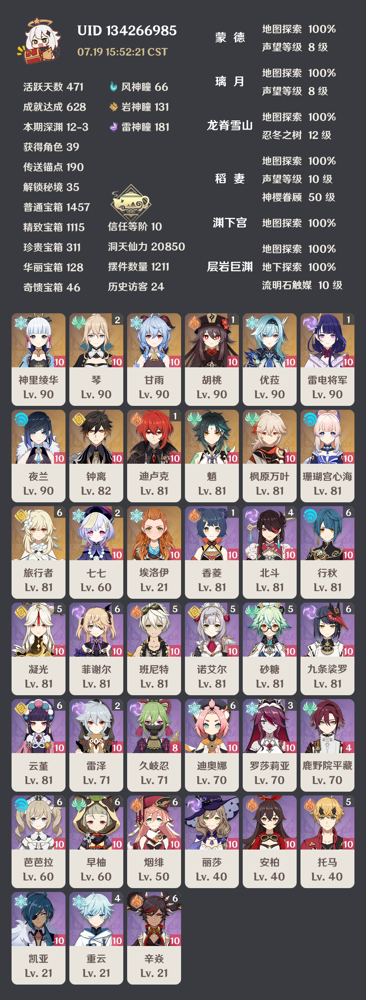
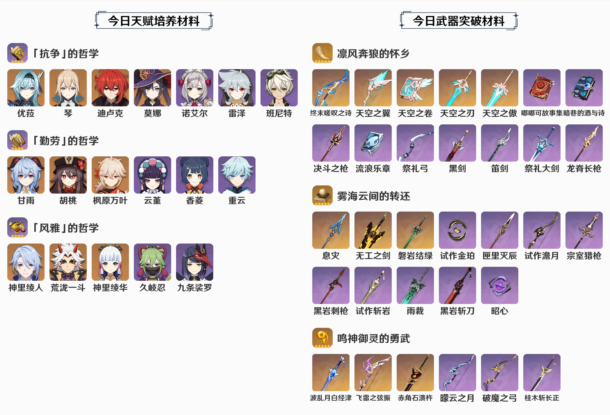
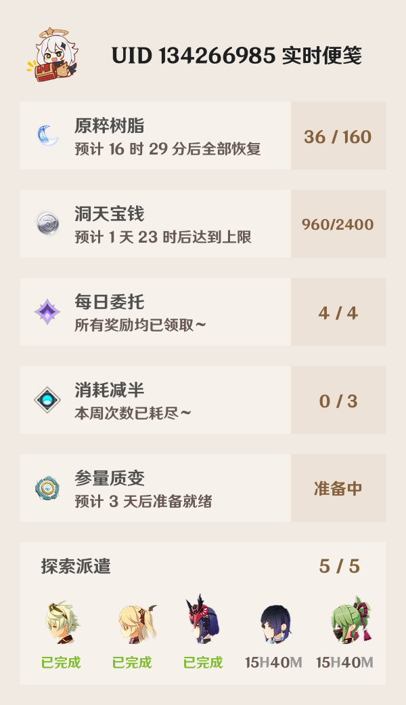

[@nonebot/nonebot2](https://github.com/nonebot/nonebot2) 是一款跨平台 Python 异步聊天机器人框架。我已经不太记得第一次使用它是出于什么缘由了，当时凭借着薄弱的 Python 基础，跟着 [Alpha 版本官方文档](https://61d3d9dbcadf413fd3238e89--nonebot2.netlify.app/) 的示例就开始编写插件…… 就这样一直到了今天，动手实现的功能估摸着有十数个了。这些插件有很多共同点，实际上一个模板就能批量生产出许多类似功能的插件。我觉得也许记下来是有价值的。

由于我疏于学习 NoneBot2 的新特性，一直停留在 `2.0.0.a16` 版本（NoneBot2 Alpha 阶段的最后一个版本），编写的插件也只保证了在此版本的可用性。而 NoneBot2 进入 Beta 阶段以来，在适配器、依赖注入等诸多方面有了很多新的特性，导致原先 Alpha 版本插件的一些写法过时。不过这对本文的大部分内容应该没有影响。

## 利用 HTTPX 获取数据

[@encode/httpx](https://github.com/encode/httpx) 是 Python 3 的全功能 HTTP 客户端，提供了同步和异步 API，并支持 HTTP/1.1 和 HTTP/2。其 [官方文档](https://www.python-httpx.org/) 提供了详细的使用说明。

HTTPX 是获取数据的工具，数据的源头则是应用编程接口（Application Programming Interface, API），如 [@mixmoe/HibiAPI](https://github.com/mixmoe/HibiAPI)、[Ten▪Api](https://tenapi.cn/)、[@genshindev/api](https://github.com/genshindev/api) 等公开可用的 API。一般来说使用诸如「应用名称+API」的关键词搜索就能找到现成的接口，如果没有，那么也可以尝试通过抓包等方式获取 API 地址。以上所说的 API 通常是通过向固定的网址发送 HTTP 请求获取返回数据的。

获取数据的函数一般定义在 `data_source.py` 文件中，比如我经常这样写：

```python
import json
from typing import Dict

from httpx import AsyncClient
from nonebot.log import logger

resPath = "/home/monsterx/.cache/bot/"


async def getData() -> Dict:
    api = (
        "https://api-static.mihoyo.com/common/"
        "blackboard/ys_obc/v1/get_activity_calendar"
    )
    async with AsyncClient() as client:
        # 请求 API
        res = await client.get(api, params={"app_sn": "ys_obc"})
    try:
        resJson = res.json()
        # 将 API 返回缓存到本地文件
        cacheThis = f"{resPath}raw.json"
        with open(cacheThis, "w", encoding="utf-8") as f:
            json.dump(resJson, f, ensure_ascii=False, indent=2)
        return resJson
    except json.decoder.JSONDecodeError as e:
        logger.error(f"解析 API 返回出错 {e}")
        return {}
```

这个例子在网址中携带查询参数 `app_sn=ys_obc` 向 API 发起了 GET 请求，并将请求结果缓存到本地文件。如何从 API 获取数据需要根据 API 说明修改 L17 的请求方式、请求头、请求正文、是否跟随重定向等，常见情况在《[QuickStart - HTTPX](https://www.python-httpx.org/quickstart/)》中均可以找到示例，HTTPX 的具体用法也应该从该文档查阅。

HTTPX 除了像上面这样从 API 获取字典格式的数据外，还常结合 [Pillow](https://pillow.readthedocs.io/en/stable/) 库用来获取图片：

```python
from io import BytesIO
from pathlib import Path
from typing import Union

from nonebot.log import logger
from PIL import Image

resPath = "/home/monsterx/.cache/bot/"


# 获取图片 Image.Image
async def pic2Image(name: str, url: str) -> Union[Image.Image, None]:
    localPic = f"{resPath}material/{name}.png"  # 根据输入 name 确定本地文件路径
    if Path(localPic).is_file():
        # 如果本地文件存在则直接打开
        userImage = Image.open(localPic)
    else:
        # 本地文件不存在则使用输入 url 下载
        async with AsyncClient() as client:
            try:
                res = await client.get(url, timeout=20.0)
                # 将请求返回的数据作为图片保存到本地文件
                userImage = Image.open(BytesIO(res.content))
                userImage.save(localPic, quality=100)
            except Exception as e:
                logger.error(f"下载图片 {name} 出错 {type(e)}：{e}")
                userImage = None
    # 返回 URL 图片的 Image 对象
    return userImage
```

绘制原神角色卡片时，有些新角色的图片本地并不存在，但是通过相关接口可以获取到该图片链接。这时我就会使用上面这段函数，在第一次用到这张图片时将其从远程下载到本地，后续直接使用本地文件。

## 利用 Playwright 获取数据

有时，数据的提供者采用复杂的加密手段阻止接口被第三方调用，~~亦或是插件编写者懒得查找接口从源头处理数据，~~ 那么 [@microsoft/playwright-python](https://github.com/microsoft/playwright-python) 库是一个不错的选择。Playwright 是一个跨浏览器、跨平台、跨语言的自动化测试工具，在编写插件时可以利用其模拟浏览器操作来获取数据。

Playwright 之于 Python，就如 [@puppeteer/puppeteer](https://github.com/puppeteer/puppeteer) 之于 Node.js。在著名 RSS 生成器项目 [@DIYgod/RSSHub](https://github.com/DIYgod/RSSHub) 的《[参与我们 - RSSHub](https://docs.rsshub.app/joinus/quick-start.html#ti-jiao-xin-de-rsshub-gui-ze-bian-xie-jiao-ben-huo-qu-yuan-shu-ju)》文档中介绍了三种获取数据方法的推荐优先级：

> 1. 使用 got 从接口获取数据
> 2. 使用 got 从 HTML 获取数据
> 3. 使用 puppeteer 渲染页面获取数据

其中使用 HTTPX 请求 API 返回数据的方式与上面的 1 类似，是最为推荐的。而使用 Playwright 则相当于上面的 3，这种方式性能较差且消耗较多资源（因为需要额外的浏览器进程），一般来讲是最不推荐的。

> 通过 `pip install playwright` 安装 Playwright 库后，还需要执行 `playwright install-deps && playwright install` 安装浏览器必需组件。

抛开性能不谈，使用 Playwright 获取数据的代码从某种程度上来说可能更直白，比如像这样：

```python
from typing import Dict

from nonebot.log import logger
from playwright._impl._api_types import TimeoutError as PlaywrightTimeoutError
from playwright.async_api import async_playwright


async def getChim(num: int) -> Dict:
    url = f"https://www.laohuangli.net/zhuge/{num}.html"
    # 定义所需内容的 CSS 选择器
    contentSelector = (
        "body > div > table:nth-child(5) > tbody > tr > td > div > table:nth-child(5)"
        " > tbody > tr > td > div > table > tbody > tr > td:nth-child(1) > div"
    )
    fortuneSelector = "div > b"
    trigramSelector = "div > p:nth-child(2)"
    poemSelector = "div > p:nth-child(4) > span"
    intpnOneSelector = "div > p:nth-child(6)"
    intpnTwoSelector = "div > p:nth-child(7)"
    detailSelector = "div > p:nth-child(9)"
    # 使用 Playwright 获取数据
    async with async_playwright() as p:
        browser = await p.chromium.launch()  # 打开浏览器
        page = await browser.new_page(viewport={"width": 1920, "height": 1080})  # 新建标签页
        await page.goto(url, wait_until="networkidle")  # 打开网址
        title = await page.title()  # 页面标题
        logger.info(title.replace(" 诸葛测字算命 老黄历网", ""))
        # 等待内容加载
        try:
            await page.wait_for_selector(contentSelector, timeout=5000)
        except PlaywrightTimeoutError:
            raise Exception("获取内容失败")
        # 获取内容的 ElementHandle
        content = await page.query_selector(contentSelector)
        assert content is not None  # 断言内容存在，阻止类型检查报错
        # 定义结果字典和其中各部分对应的选择器
        result, dataMap = {}, [
            {"selector": fortuneSelector, "key": "fortune", "replace": f"诸葛神算第{num}签"},
            {"selector": trigramSelector, "key": "trigram"},
            {"selector": poemSelector, "key": "poem"},
            {"selector": intpnOneSelector, "key": "intpnOne", "replace": "解签一："},
            {"selector": intpnTwoSelector, "key": "intpnTwo", "replace": "解签二："},
            {"selector": detailSelector, "key": "detail", "replace": "详解"},
        ]
        # 循环填充结果字典
        for item in dataMap:
            # 获取内容的 ElementHandle，确保其存在
            try:
                value = await content.query_selector(item["selector"])
                assert value is not None
            except (PlaywrightTimeoutError, AssertionError):
                logger.error(f"获取{item['key']}失败")
                continue
            # 将元素的 innerText 填充到结果字典
            result[item["key"]] = await value.inner_text()
            # 根据需要对直接取得的结果额外处理，比如去除空格
            if item.get("replace"):
                result[item["key"]] = result[item["key"]].replace(item["replace"], "")
            if item["key"] != "trigram":
                result[item["key"]] = result[item["key"]].replace(" ", "")
            result[item["key"]] = result[item["key"]].strip()
        # 关闭浏览器，释放资源
        await browser.close()
        # 返回结果
        logger.info(result)
        return result
```

这是我从 [老黄历网](https://www.laohuangli.net/zhuge/1.html) 获取三百八十四诸葛神算签的数据时写的，稍微改造一下就能抓取所有签文信息（所以说拿 Playwright 做小数据爬虫其实也可行）。代码看起来长了些，但实际上按照注释解读一下是没什么技术含量的。如果安装了 Visual Studio Code 的 Python 插件，将鼠标放在函数名称上就能显示出所有可用的参数和意义，对代码的理解应该会有很大帮助。

这段代码中首先启动浏览器进程（L23）、然后创建新标签页（L24）、最后在新标签页中打开网址（L25）。后面则是处理 HTML 内容，需要有一定 CSS/JavaScript 基础，Playwright 的许多方法名跟原生 JavaScript 一致，对于吃前端饭的大佬应该比较容易上手。总之利用好 [官方文档](https://playwright.dev/python/docs/intro) 会对写代码帮助非常大。

这一部分的最后是我写了一些 Playwright 的代码后的心得：

1. 在打开网址时根据需要选择 `page.goto()` 的 `wait_until` 参数，这里用的 `networkidle` 即等待所有网络请求结束，适合有大文件需要加载的场合。
2. 在使用 `page.query_selector()` 类似的函数获取 ElementHandle 对象时，经常出现无法获取到对应选择器的错误，导致程序将很多时间花在等待上。可以尝试利用 L28-32 的异常处理、合理选择 `timeout` 等待超时参数来搞定它。
3. `element_handle.scroll_into_view_if_needed()` 可以将元素滚动到视图内，在一些采用了懒加载（Lazyload）的网页上可能有帮助，这是关于此方法的 [文档](https://playwright.dev/python/docs/api/class-elementhandle#element-handle-scroll-into-view-if-needed)。
4. 如果 JavaScript 对你来说更加熟悉，那么 `element_handle.eval_on_selector()` 是个好东西，它能帮你模拟在控制台执行 JavaScript，这是关于此方法的 [文档](https://playwright.dev/python/docs/api/class-elementhandle#element-handle-eval-on-selector)。
5. 很多时候一个 CSS 选择器对应的元素不止一个，这时可以用 `element_handle.query_selector_all()`，对应 JavaScript 里的 `Element.querySelectorAll()`，这是关于此方法的 [文档](https://playwright.dev/python/docs/api/class-elementhandle#element-handle-query-selector-all)。
6. 使用定位器 `page.locator()` 也许可以简化对具有相同 CSS 选择器的一组元素的操作，这是关于此方法的 [文档](https://playwright.dev/python/docs/locators)。
7. 及时使用 `page.close()` 关闭标签页，使用 `browser.close()` 关闭浏览器进程。

~~在 Gist 我还存放了一些关于 Playwright 有趣的用法~~

## 利用 Pillow 绘制图片

使用机器人高频发送大段文字可能导致封号、直接发送文字消息排版不易，所以很多时候发送图片是更好的选择。Python 绘图的一种方法是使用 [@python-pillow/Pillow](https://github.com/python-pillow/Pillow) 库（对于数据统计之类图表绘制来说推荐使用 [@matplotlib/matplotlib](https://github.com/matplotlib/matplotlib)）。

Pillow 绘图一般至少需要两个参数，其中一个是坐标，另一个是待绘制的内容（可以是文字，也可以是另一张图片）。将一张图片的左上角作为原点，以水平向右为横轴 x 坐标轴，以水平向下为纵轴 y 坐标轴，便可以确定图片中每个像素点的坐标。下面列出一些常用的代码，更多的绘制方法就需要根据 [官方文档](https://pillow.readthedocs.io/en/stable/) 学习了。

1. 图片基本操作

```python
from PIL import Image, ImageDraw, ImageFont


# 设置 Pillow 绘制字体
def font(size):
    return ImageFont.truetype("/path/to/font/zh-cn.ttf", size=size)


# 新建颜色模式 RGBA、宽 500 高 600、背景颜色 #393B40 的图片
img = Image.new("RGBA", (500, 600), "#393B40")
# 打开现有图片
img = Image.open("/path/to/pic/avatar.png")
# 将图片颜色模式转换到 RGBA
img = img.convert("RGBA")
# 使用抗锯齿重采样过滤器（resampling filter）将图片缩放到宽 70 高 70
img = img.resize((70, 70), Image.ANTIALIAS)
# 从图片 img 中裁减坐标 xy(20, 30) 到坐标 xy(80, 100) 范围内图像
img = img.crop((20, 30, 80, 100))
# 将图片顺时针旋转 45 度
img = img.rotate(45)
# 将图片左右翻转 / 上下翻转
img = img.transpose(Image.Transpose.FLIP_LEFT_RIGHT)
img = img.transpose(Image.Transpose.FLIP_TOP_BOTTOM)

# 在图片 img 上粘贴图片 anotherImg，粘贴后 anotherImg 左上角位于 img 的 xy(30, 50)
img.paste(anotherImg, (30, 50), anotherImg)
```

2. 常用几何图形的绘制：

```python
# 使用颜色模式 RGBA 在图片 img 上绘制
draw = ImageDraw.Draw(img, "RGBA")

# 在坐标 xy(0, 0) 到坐标 xy(100, 100) 范围内
# 绘制边框宽度 1 边框颜色 #000000 填充颜色 #ffffff 的圆形
draw.ellipse(
    (0, 0, 100, 100),
    fill="#ffffff", outline="#000000", width=1
)

# 在坐标 xy(0, 1) 到坐标 xy(100-1, 200-1) 范围内
# 绘制边框宽度 1 边框颜色 #000000 填充颜色 #ffffff 的矩形
draw.rectangle(
    (0, 1, 100 - 1, 200 - 1),
    fill="#ffffff", outline="#000000", width=1
)

# 绘制圆角矩形，和前面矩形只差 radius=20 的圆角
draw.rounded_rectangle(
    (0, 1, 100 - 1, 200 - 1),
    radius=20, fill="#ffffff", outline="#000000", width=1
)
```

3. 字符串的绘制

```python
# 使用颜色模式 RGBA 在图片 img 上绘制
draw = ImageDraw.Draw(img, "RGBA")

# 以坐标 xy(20, 30) 为待绘制字体的左上角绘制颜色 #ffffff 字号 26 的字符串 Hello
draw.text(
    (20, 30), "Hello", font=font(26), fill="#ffffff",
)

# 字符串居中绘制时，需要根据显示位置和字体尺寸计算绘制起点
# 如下表示需要在坐标 xy(30, 20) 到坐标 xy(100, 60) 确定的矩形范围内居中绘制
fontW, fontH = font(26).getsize("World")
textCenter = (
    ((100 - 30) - fontW) / 2 + 30,
    ((60 - 20) - fontH) / 2 + 20,
)
draw.text(textCenter, "World", font=font(26), fill="#ffffff")
```

4. 矩形图像添加圆角

    只要随便一搜就会看见这样的代码：创建透明正方形图片 A，在 A 上绘制不透明正圆形；创建与待添加圆角图像等大的不透明图片 B，将图像 A 分割为四角分别粘贴；将 B 作为待添加圆角图像的 Alpha 通道。

```python
# 图片圆角处理
def circleCorner(markImg: Image.Image, radius: int = 30) -> Image.Image:
    markImg = markImg.convert("RGBA")
    w, h = markImg.size
    # 创建透明正方形图片 A，其边长为 radius * 2
    circle = Image.new("L", (radius * 2, radius * 2), 0)
    # 在 A 上绘制不透明正圆形，其半径为 radius
    draw = ImageDraw.Draw(circle)
    draw.ellipse((0, 0, radius * 2, radius * 2), fill=255)
    # 创建与待添加圆角图像等大的不透明图片 B
    alpha = Image.new("L", markImg.size, 255)
    # 将图像 A 分割为四角分别粘贴
    alpha.paste(circle.crop((0, 0, radius, radius)), (0, 0))
    alpha.paste(circle.crop((radius, 0, radius * 2, radius)), (w - radius, 0))
    alpha.paste(
        circle.crop((radius, radius, radius * 2, radius * 2)),
        (w - radius, h - radius),
    )
    alpha.paste(circle.crop((0, radius, radius, radius * 2)), (0, h - radius))
    # 将 B 作为待添加圆角图像的 Alpha 通道
    markImg.putalpha(alpha)
    return markImg

# 在图片 img 上粘贴图片 anotherImg
# 和前面粘贴区别在于 anotherImg 四角为 radius=30 的圆角
anotherImg = circleCorner(anotherImg, radius=30)
img.paste(anotherImg, (30, 50), anotherImg)
```

上面这些代码基本搞定了我的插件 Pillow 绘图需求，还有很多高级功能我都没有用到。如果有相关需求，我十分推荐前往 [@MeetWq](https://github.com/MeetWq) 开发的插件中学习，比如 [@noneplugin/nonebot-plugin-petpet](https://github.com/noneplugin/nonebot-plugin-petpet)、[@noneplugin/nonebot-plugin-memes](https://github.com/noneplugin/nonebot-plugin-memes)。

## 利用 Playwright 渲染图片

Pillow 的功能已经十分强大，但是我觉得它的代码写起来有些枯燥且繁琐，于是对于稍微复杂的图片绘制我都会逃避使用 Pillow，而是选择 Playwright。Playwright 作为自动化测试工具，除了前面介绍的用法也可以用来渲染本地 HTML 文件并进行截图。

Playwright 提供了全屏截图和元素截图，用法如下：

1. [全屏截图](https://playwright.dev/python/docs/screenshots#full-page-screenshots)

```python
# 对标签页 page 打开的网页进行全屏截图
await page.screenshot(path="screenshot.png", full_page=True)
```

2. [元素截图](https://playwright.dev/python/docs/screenshots#element-screenshot)

```python
# 对 CSS 选择器 .class 对应元素进行截图
await page.locator(".class").screenshot(path="screenshot.png")
# 对一个已有的 ElementHandle 进行截图
await element_handle.screenshot(path="screenshot.png")
```

上述代码都将截图写入文件，有时不希望如此，可以使用缓冲区（buffer）：

```python
from io import BytesIO

from PIL import Image


# 截图为 Image.Image 对象
screenshot_bytes = await page.screenshot()
image = Image.open(BytesIO(screenshot_bytes))
```

利用 Playwright 渲染图片前，还需要创建渲染的 HTML 文件。我经常先创建一个 HTML 模板文件，其中待显示的内容用一串占位符代替；然后在 Python 中利用 `str.replace()` 将模板中的占位符替换为需要的内容，另存为临时文件；利用 Playwright 打开临时 HTML 文件，执行截图，完成后删除临时文件。这种完全手动编写 HTML 模板渲染的方式学习成本较低，但是在一些复杂的场合可能代码就不那么优雅了，这时可以考虑使用 [@pallets/jinja](https://github.com/pallets/jinja) 来创建 HTML 模板。Jinja2 是现代的、设计者友好的、仿照 Django 模板的 Python 模板语言，采用 Jinja2 创建模板并渲染的代码可以参考这份 [非官方中文文档](http://docs.jinkan.org/docs/jinja2/) 和一些 Nonebot2 插件。

下面总结一下完全手动方式的代码流程。

1. 新建一个 HTML 模板文件 `tpl.html`

```html
<!DOCTYPE html>
<html>
<head>
    <link rel="stylesheet" type="text/css" href="./tpl.css" />  <!-- 相对此文件的 -->
    <style>
        @font-face {
            font-family: "GenshinCN";
            src: url("./zh-cn.ttf");  /** 相对此文件的 */
        }
        body {
            font-family: "GenshinCN";
            background-color: #f0f0f0;
        }
        .container {
            height: 360px;
            width: 300px;
            margin-left: calc(50% - 150px);
            margin-top: 20px;
            background: #e3d8aa;
            box-shadow: 2px 2px 2px 1px rgb(0 0 0/20%);
            position: relative;
        }
    </style>
</head>
<body>
    <div class="container">
        {{content}}
    </div>
</body>
</html>
```

2. 在 Python 中替换模板中的占位符，并另存新的临时文件

    注意临时文件命名最好具有唯一性，否则一段代码被多个 QQ 消息同时触发时，截图调用的临时文件错乱，最终消息响应结果就会出错。

```python
# 待显示内容预先处理
content = "what you get"
# 打开模板文件
with open("/path/to/tpl.html", encoding="utf-8") as f:
    template = str(f.read())
# 替换占位符
template = template.replace("{{content}}", content)
# 另存临时文件
tmp = f"/path/to/tpl.{flag}.html"  # 最好使临时文件命名具有唯一性
with open(tmp, "w", encoding="utf-8") as f:
    f.write(template)
```

3. 在 Python 中调用 Playwright 截图

    这里 `element_handle.screenshot()` 产生的截图不保存到文件，而是直接被转换为 Base64 编码字符串。发送图片时直接将图片 Base64 编码字符串传递给 nonebot2 的 `MessageSegment.image()` 即可。

```python
import os
from base64 import b64encode
from io import BytesIO


# 运行 Playwright 截图
# browser = await get_browser()
# tmp = f"/path/to/tpl.{flag}.html"
try:
    page = await browser.new_page()  # 新建标签页
    await page.set_viewport_size({"width": 700, "height": 1500})  # 设定视图大小
    await page.goto("file://" + tmp)  # 打开模板文件
    # 使用 CSS 选择器指定截图对象并保证其加载
    card = await page.query_selector(".container")
    assert card is not None
    # 截图并将图片转换为 Base64 编码字符串
    picBytes = await card.screenshot()
    res = "base64://" + b64encode(picBytes).decode()
    await page.close()  # 关闭标签页
except Exception as e:
    logger.error(f"生成图片失败 {type(e)}：{e}")
    res = "生成图片失败！"
# 删除临时文件
try:
    os.remove(tmp)
except Exception:
    pass

# 发送消息时
await Matcher.finish(
    MessageSegment.image(res)  # 为 Base64 字符串时调用 image
    if "base64" in res
    else MessageSegment.text(res)  # 为普通字符串时调用 text
)
```

这里 L7 使用了名为 `get_browser()` 的异步函数来获取浏览器对象，其具体代码可以参考 [@HibiKier/zhenxun_bot](https://github.com/HibiKier/zhenxun_bot/blob/main/utils/browser.py) 和 [@SK-415/HarukaBot](https://github.com/SK-415/HarukaBot/blob/master/src/plugins/haruka_bot/utils/browser.py)，其作用是：创建截图时，总是尝试在已有的浏览器进程中新建标签页，而不是另起一个全新的浏览器。这也是本段代码只在 L19 关闭了标签页而没有关闭整个浏览器的原因。

## 利用 JSON 缓存数据

为避免不必要的网络请求，浏览器通常都会使用 HTTP 缓存。如果一个网络请求存在匹配，则从缓存中读取响应，从而消除网络延迟和传输产生的数据成本。网站如此，机器人亦如此。除了从成本角度考虑，很多时候机器人频繁地请求 API 可能导致机器人 IP 被 API 服务器封禁、无法正常获取响应。此外，诸如米游社之类的某些接口本身也存在缓存，1 至 2 小时才会更新，没有总是实时请求的必要。

为了合理地使用缓存我通常使用这样几个函数：

1. 实时请求

    和第一部分利用 HTTPX 获取数据的函数相同，只是在写入缓存前添加了一个 `time` 字段记录缓存的时间。注意，如果后续单纯使用 `getData()` 不为空作为继续执行的条件将引起错误，可以根据需要使用 `Dict.get("data")` 之类作为判断是否非空的对象。

    这里自行添加 `time` 字段其实感觉并不十分优雅，如果原返回包含时间信息，应该优先使用原返回中的时间信息。

```python
import json
from typing import Dict

from httpx import AsyncClient
from nonebot.log import logger

resPath = "/home/monsterx/.cache/bot/"


async def getData() -> Dict:
    api = (
        "https://api-static.mihoyo.com/common/"
        "blackboard/ys_obc/v1/get_activity_calendar"
    )
    async with AsyncClient() as client:
        # 请求 API
        res = await client.get(api, params={"app_sn": "ys_obc"})
    try:
        resJson = res.json()
        # 添加缓存时间戳
        resJson["time"] = int(time.time())
        # 将 API 返回缓存到本地文件
        cacheThis = f"{resPath}raw.json"
        with open(cacheThis, "w", encoding="utf-8") as f:
            json.dump(resJson, f, ensure_ascii=False, indent=2)
        return resJson
    except Exception as e:
        logger.error(f"请求 API 出错 {type(e)}: {e}")
        return {}
```

2. 缓存检查

    第一步缓存的字典内容具有 `time` 字段，判断其是否失效就好办多了，只需要将当前时间与缓存时间比较即可。我通常让缓存有效时返回缓存内容、缓存失效时返回空。

```python
import json
import time
from pathlib import Path
from typing import Dict

# 检查缓存是否有效
async def cacheChecker(cacheFile: str, cacheTime: int = 3600) -> Dict:
    # 缓存文件不存在，返回空
    if not Path(localPic).is_file():
        return {}
    # 还存文件存在，判断时效
    timeNow = int(time.time())  # 当前时间
    with open(cacheFile, encoding="UTF-8") as f:
        cache = json.load(f)
    timeCache = int(cache["time"])  # 缓存时间
    # 当前时间与缓存时间差值在指定范围内则缓存有效
    if timeNow - timeCache < cacheTime:
        return cache  # 缓存有效返回缓存内容
    else:
        return {}  # 缓存失效返回空
```

3. 获取数据入口

    获取数据的入口需要合理地决定何时返回缓存、何时重新请求。我通常会传入一个 `force` 参数决定是否需要强制刷新。

```python
# 获取数据入口
async def dataEntrabce(force: bool = False) -> Union[str, Dict]:
    # 缓存文件的路径，与第 1 步实时请求后缓存文件命名规则相同
    cacheFile = f"{resPath}raw.json"
    # 检查缓存，要求强制刷新时与缓存失效效果相同（返回空）
    data = await cacheChecker(cacheFile, 300) if not force else {}
    # 可以通过判断返回字典的索引初步确定数据是否完整
    if data and list(data.keys()) != ["time"]:
        return data  # 缓存数据完整直接返回
    # 发起实时请求，同时产生了成功请求的缓存
    data = await getData()
    if not data:
        return "暂时无法访问数据接口！"  # 实时请求数据不完整视为失败
    else:
        return data  # 实时请求数据完整直接返回
```

以上实现缓存与刷新的函数将数据写入 JSON 文件，在实际运行时需要重复进行文件读写。如果有高级需求，采用数据库可能会更好。

## ~~利用 GitHub Actions 代替直连~~

在境内服务器上部署机器人时，某些网站的直连访问效果不甚理想，通常大家会选择使用配置代理来解决。其实我觉得某些场合使用 GitHub Actions 也不错，GitHub Actions 的运行环境不仅访问境外服务速度不错、还能在某些方面分担机器人服务器压力（指把吃性能的代码一股脑丢给 GitHub Actions 执行）。

我之前尝试制作原神抽卡模拟功能，需要获取角色、武器的抽卡图片。我选择了利用 Playwright 定时抓取 [Honey Impact](https://genshin.honeyhunterworld.com/?lang=CHS) 的数据，将图片下载并上传到 CDN。这样机器人请求 CDN 获取图片等数据，要比直接从 Honey Impact 获取快的多；而且 Playwright 定时抓取感觉还是比较占用资源的，和机器人本体分离之后也不用考虑相关影响了。

> 感觉此部分内容其实不太推荐，只是提供一种思路，姑且就写这么多吧。

## 利用 COS 发送私聊文件

向机器人提供接口的 [@Mrs4s/go-cqhttp](https://github.com/Mrs4s/go-cqhttp) 只实现了 [上传群文件](https://docs.go-cqhttp.org/api/#%E4%B8%8A%E4%BC%A0%E7%BE%A4%E6%96%87%E4%BB%B6) 接口，在私聊对话中无法发送文件。暂时只能曲线救国，采用发送文件下载直链的方式间接实现私聊文件发送。我部署机器人的服务器为腾讯云机器，所以就顺手采用了腾讯云对象存储（Cloud Object Storage, COS）储存文件。

腾讯云官方提供了 COS 的 Python SDK [@tencentyun/cos-python-sdk-v5](https://github.com/tencentyun/cos-python-sdk-v5)，也提供了 [快速入门](https://cloud.tencent.com/document/product/436/12269)、[上传文件](https://cloud.tencent.com/document/product/436/65820) 等文档。根据文档说明，开始使用 COS 前需要前往 [API 密钥管理](https://console.cloud.tencent.com/cam/capi) 创建用于 Python SDK 访问存储桶的 `SecretId` 和 `SecretKey`。创建 COS 存储桶时如果选用公开读权限，则文件链接不需要签名即可访问，但是这样容易造成流量超限，建议采用私有权限，发送文件时可根据 [签名方法 v3](https://cloud.tencent.com/document/api/213/30654#Python) 生成链接签名。

我将初始化 COS 客户端、上传文件、计算链接签名的 Python 代码整理了一下：

```python
import hmac
import os
import time
from hashlib import sha1

from nonebot.log import logger
from qcloud_cos.cos_exception import CosClientError, CosServiceError

bucketName = "name-idnumber"
bucketRegion = "ap-shanghai"
secretId = "AKIDz8krbsJ5yKBZQpn74WFkmLPx3*******"
secretKey = "Gu5t9xGARNpq86cd98joQYCN3*******"


# 计算 COS 文件链接签名表单字段
# https://cos5.cloud.tencent.com/static/cos-sign/
def getSignature(file: str) -> str:
    def toBytes(s: str) -> bytes:
        return s.encode("utf-8")

    # SignKey = HMAC-SHA1(SecretKey, [q-key-time])
    signTime = int(time.time()) - 60
    expireTime = signTime + 3600
    timeStr = f"{signTime};{expireTime}"
    signKey = hmac.new(toBytes(secretKey), toBytes(timeStr), sha1).hexdigest()
    # HttpString = [HttpMethod]\n[HttpURI]\n[HttpParameters]\n[HttpHeaders]\n
    httpString = "get\n/{}\n\n\n".format(file)
    # StringToSign = [q-sign-algorithm]\n[q-sign-time]\nSHA1-HASH(HttpString)\n
    httpStrSha = sha1(toBytes(httpString)).hexdigest()
    strToSign = "sha1\n{}\n{}\n".format(timeStr, httpStrSha)
    # Signature = HMAC-SHA1(SignKey,StringToSign)
    sign = hmac.new(toBytes(signKey), toBytes(strToSign), sha1).hexdigest()
    params = [
        "q-sign-algorithm=sha1",
        f"q-ak={secretId}",
        f"q-sign-time={timeStr}",
        f"q-key-time={timeStr}",
        "q-header-list=",
        "q-url-param-list=",
        f"q-signature={sign}",
    ]
    return "&".join(params)


# 初始化 COS 客户端，一个 Bucket 只需一个客户端即可
def initCosClient() -> object:
    try:
        from qcloud_cos import CosConfig, CosS3Client
    except ImportError:
        from pip._internal import main as pipmain

        pipmain(["install", "cos-python-sdk-v5"])
        from qcloud_cos import CosConfig, CosS3Client
    except Exception as e:
        logger.error(f"安装 XML Python SDK 失败 {type(e)}：{e}")
        return None
    try:
        config = CosConfig(
            Region=bucketRegion,
            Token=None,
            Scheme="https",
            SecretId=secretId,
            SecretKey=secretKey,
        )
        client = CosS3Client(config)
        return client
    except Exception as e:
        logger.error(f"初始化 COS Client 失败 {type(e)}：{e}")
        return None


# 使用高级接口上传文件到 COS
async def uploadFile(client: object, filePath: str) -> str:
    bucketDomain = f"https://{bucketName}.cos.{bucketRegion}.myqcloud.com"
    fileName = filePath.split(os.sep)[-1]
    for i in range(0, 10):
        try:
            response = client.upload_file(  # type: ignore
                Bucket=bucketName,
                Key=fileName,
                LocalFilePath=filePath,
                StorageClass="STANDARD",
                EnableMD5=False,
            )
            logger.debug("文件上传 Etag：" + response["ETag"])
            break
        except CosClientError or CosServiceError as e:
            logger.error(f"上传文件 {fileName} 到 COS 失败\n{e}")
    urlSigned = f"{bucketDomain}/{fileName}?{getSignature(fileName)}"
    return urlSigned
```

修改 L9-12 为指定的腾讯云 COS 配置，在需要发送私聊文件的项目中，我使用了这样的结构：

```python
import os

from .upload_cos import initCosClient, uploadFile


cosClient = initCosClient()
filePath = "/path/to/file/example.xlsx"

async def _() -> str:
    if not cosClient:
        msg = "未成功初始化腾讯云对象存储，无法发送文件！"
    else:
        fileUrl = await uploadFile(cosClient, filePath)
        if fileUrl:
            msg = f"文件已上传至云存储，有效期 1 小时，请及时下载：\n{fileUrl}"
        else:
            msg = "上传文件失败，请稍后再试！"
        # 删除本地下载文件
        try:
            os.remove(filePath)
        except Exception:
            pass
    return msg
```

-------

最后是一些自己觉得效果得还不错的插件展示，能公开的插件代码我基本都放在 GitHub 里了，没有公开的大概率是因为代码写得太粗糙，不好意思公开。


<details><summary><strong>使用 Pillow 绘制原神 UID 查询结果</strong></summary><br />





</details><br />


<details><summary><strong>使用 Pillow 绘制原神每日材料查询结果</strong></summary><br />





</details><br />


<details><summary><strong>使用 Pillow 绘制原神实时便笺查询结果</strong></summary><br />





</details><br />


<details><summary><strong>使用 Playwright 绘制运势抽签结果</strong></summary><br />


模板主要参考了 [可莉特调](https://genshin.pub/)。


</details><br />


<details><summary><strong>使用 Playwright 绘制原神角色天赋查询结果</strong></summary><br />


模板来自 [@yoimiya-kokomi/miao-plugin](https://github.com/yoimiya-kokomi/miao-plugin)，做了一点点修改。


</details><br />

